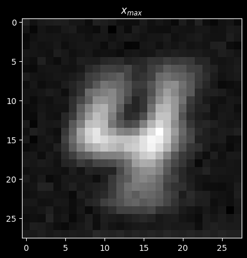
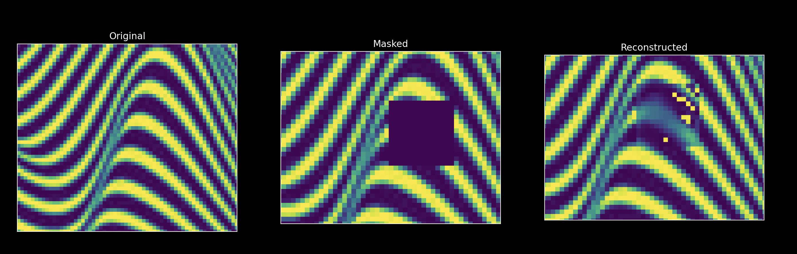
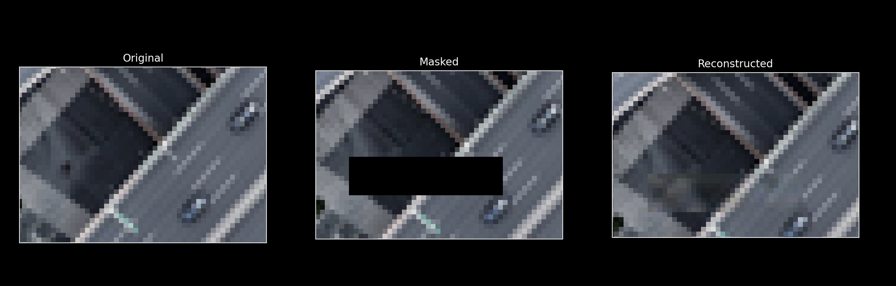

## NAIVE marginal x distribution estimation

The idea is pretty simple, and it serves as a test for the complexities behind $p(\mathbf{x})$ estimation. There is a need to convalidate what I read, and not take if for granted, this is a simple exercise in that direction. 

Given a dataset 

$$
\mathcal{D} = {x_1, x_2, \ldots, x_N}
$$

we want to estimate the marginal distribution $p(\mathbf{x})$ by assuming the following approximation

$$
p(\mathbf{x}) = \frac{\sum_{i=1}^{N} \delta(\mathbf{x} - x_i)}N
$$

therefore the marginal distribution approximation

$$
\hat{p}_{\theta}(\mathbf{x})
$$

is trained by minimizing the KL divergence between the empirical distribution and the model distribution via negative samples from the dataset, and noise samples from a normal distribution. 

For high dimensional domains, like the MNIST dataset, the approximation lacks the ability to capture the underlying distribution correctly. The model was trained with a pretty standard handcrafted CNN:

- $1$ input channel
- $4, 8, 16, 1$ output channels
- $3x3$ kernel size always
- $\text{padding}=1$
- trained with only one class label $j$
- trained with negative $p(x_i)=0$ samples where $i!=j$  

The results were good enough to show that the model is able to capture the underlying distro

$$
\text{train} p_{\theta} \ \text{over} \ \mathcal{D} \rightarrow \mathbf{x}_{max} = \max{p(\mathbf{x}| \theta)}  \rightarrow \text{check how it looks like}$$

## RLUD: Hey mom look, no embedding space!

Hey sorry mom to dissapoint you but this is just a stupid way for reconstructing missing parts of images with long lasting training. I am very sorry to confess that the reconstruction must be for masks that are separated `mask_width` and `mask_height` pixels from the border of the image. 

My idea is like a `transformer` but way worse, but it works to some extent, so maybe tonight I get to eat my desert right? I mean it trains for 20 minutes to badly reconstruct missing parts, but it is cool, I guess...

<!-- refernce to image in assets folder -->

